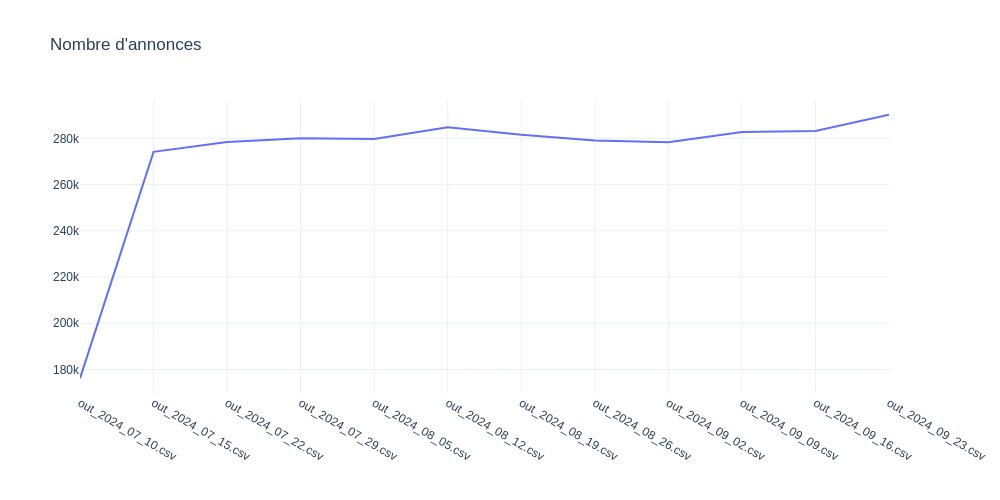
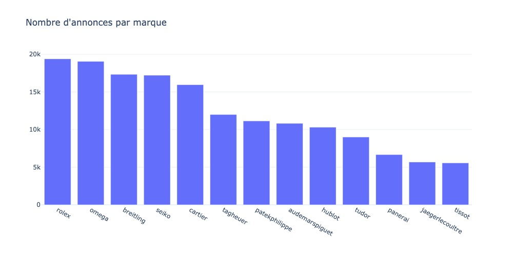
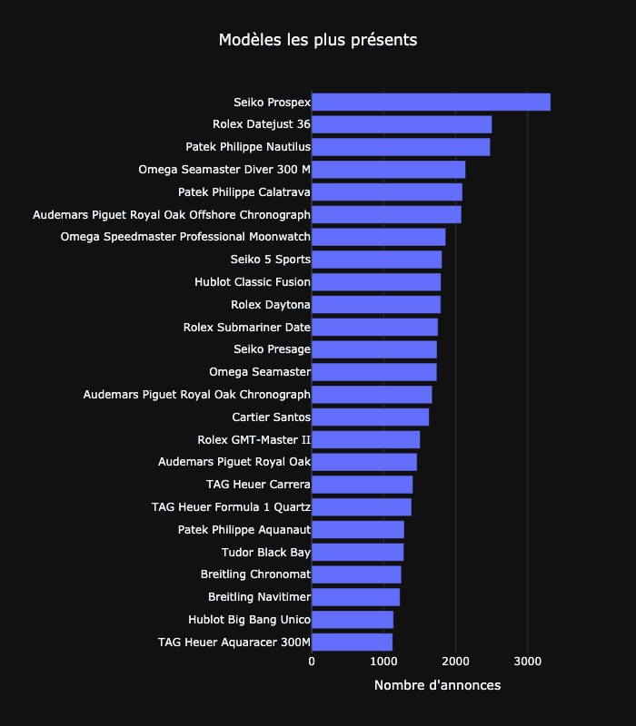
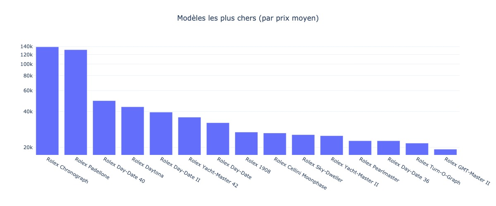
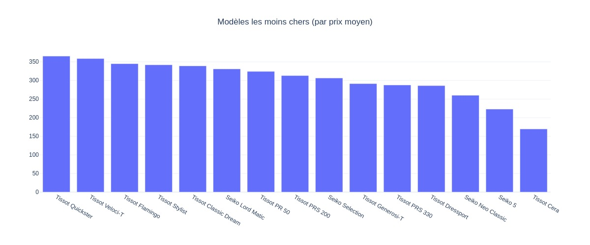

## Données

## Analyse des dernières données
Nom du dernier fichier: out_2024_08_12.csv

## Détails des marques
|Marque|Nombre d'annonces|Prix moyen|Prix max|Prix median|
|------|-----------------|----------|--------|-----------|
|audemarspiguet|12881|64353 €|1547642 €|41000 €| 
|breitling|22077|5430 €|91256 €|4450 €| 
|cartier|19928|8490 €|289000 €|5549 €| 
|hublot|12374|16318 €|543400 €|12910 €| 
|jaegerlecoultre|6911|11310 €|392576 €|8000 €| 
|omega|45790|5835 €|188500 €|4507 €| 
|panerai|8040|8400 €|241298 €|6477 €| 
|patekphilippe|12956|86620 €|5740361 €|51637 €| 
|rolex|86979|19158 €|1403659 €|13140 €| 
|seiko|22034|965 €|147680 €|501 €| 
|tagheuer|14438|2883 €|59900 €|2251 €| 
|tissot|6602|645 €|27160 €|495 €| 
|tudor|10555|3921 €|110791 €|3476 €| 

## Détails des modèles
Nom du modèle|Nombre d'annonces|Prix moyen|Prix median|
|-------------|-----------------|----------|-----------|
|               Rolex Datejust 36|11238|9734 €|8499 €| 
|               Rolex Daytona|9109|48816 €|37321 €| 
|               Rolex Datejust 41|7444|13467 €|13567 €| 
|               Rolex Submariner Date|6711|17813 €|14924 €| 
|               Rolex GMT-Master II|6254|21551 €|18356 €| 
|               Rolex Lady-Datejust|5357|8708 €|7200 €| 
|               Seiko|4852|647 €|355 €| 
|               Omega Seamaster Diver 300 M|4565|5853 €|4999 €| 
|               Omega Seamaster Aqua Terra|4532|6714 €|5350 €| 
|               Seiko Prospex|4305|1069 €|751 €| 
|               Rolex Datejust 31|3681|12258 €|11262 €| 
|               Omega Constellation|3286|5695 €|4583 €| 
|               Omega Speedmaster Professional Moonwatch|3219|10238 €|6630 €| 
|               Omega Seamaster|3208|2528 €|1490 €| 
|               Omega De Ville Prestige|3052|4943 €|4000 €| 
|               Patek Philippe Nautilus|2873|143916 €|108500 €| 
|               Rolex Day-Date 36|2839|30444 €|22723 €| 
|               Rolex Sky-Dweller|2799|31351 €|24099 €| 
|               Omega|2745|3386 €|1500 €| 
|               Breitling|2688|5813 €|4927 €| 
|               Omega Speedmaster|2584|9343 €|7386 €| 
|               Audemars Piguet Royal Oak Offshore Chronograph|2532|40360 €|33708 €| 
|               Patek Philippe Calatrava|2516|25554 €|22375 €| 
|               Seiko Presage|2386|801 €|615 €| 
|               Seiko 5 Sports|2185|370 €|306 €| 
|               Rolex Day-Date 40|2184|56678 €|49898 €| 
|               Rolex Explorer II|2177|11168 €|9900 €| 
|               Hublot Classic Fusion|2135|12107 €|9120 €| 
|               Audemars Piguet Royal Oak Chronograph|1994|75772 €|60189 €| 
|               Cartier Santos|1989|10207 €|7277 €| 

 Readme generated on 12/08/2024 12:57:33