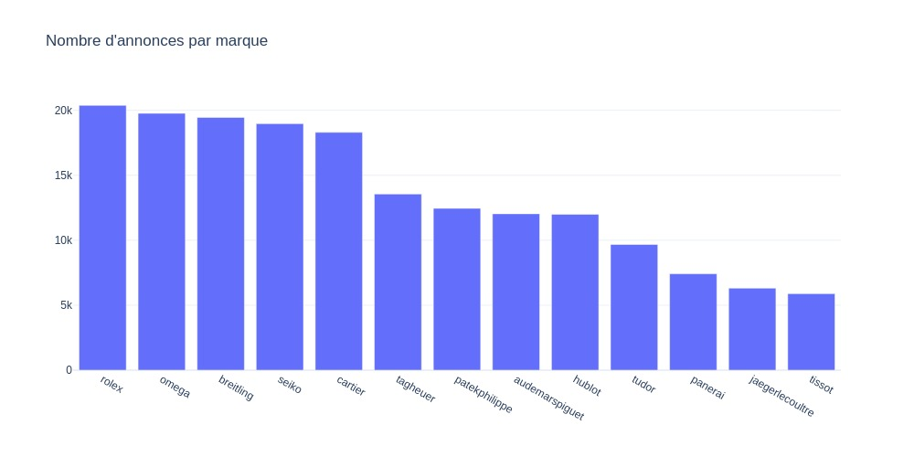

## Données

## Analyse des dernières données
Nom du dernier fichier: out_2024_07_16.csv

## Détails des marques
|Marque|Nombre d'annonces|Prix moyen|Prix max|Prix median|
|------|-----------------|----------|--------|-----------|
|audemarspiguet|11602|63655 €|1549061 €|41022 €| 
|breitling|21538|5416 €|88262 €|4429 €| 
|cartier|18704|8370 €|347582 €|5592 €| 
|hublot|12085|16287 €|543400 €|12888 €| 
|jaegerlecoultre|6234|11310 €|392608 €|7990 €| 
|omega|43302|5756 €|279500 €|4439 €| 
|panerai|7422|8427 €|187013 €|6500 €| 
|patekphilippe|11842|86886 €|5853946 €|51687 €| 
|rolex|83145|19114 €|1404946 €|12990 €| 
|seiko|21997|929 €|137388 €|496 €| 
|tagheuer|14125|2891 €|59900 €|2250 €| 
|tissot|6275|644 €|26269 €|489 €| 
|tudor|10029|4048 €|985000 €|3450 €| 

## Détails des modèles
Nom du modèle|Nombre d'annonces|Prix moyen|Prix median|
|-------------|-----------------|----------|-----------|
|Rolex Datejust 36|10886|9733 €|8464 €| 
|Rolex Daytona|8646|48637 €|36883 €| 
|Rolex Datejust 41|6932|13420 €|13517 €| 
|Rolex Submariner Date|6224|18045 €|14940 €| 
|Rolex GMT-Master II|5695|22007 €|18499 €| 
|Rolex Lady-Datejust|5172|8571 €|7139 €| 
|Seiko|4788|635 €|350 €| 
|Seiko Prospex|4365|1054 €|750 €| 
|Omega Seamaster Diver 300 M|4289|5759 €|4934 €| 
|Omega Seamaster Aqua Terra|4229|6646 €|5283 €| 
|Rolex Datejust 31|3498|12217 €|11099 €| 
|Omega Constellation|3153|5666 €|4500 €| 
|Omega Seamaster|3090|2595 €|1462 €| 
|Omega Speedmaster Professional Moonwatch|3001|10277 €|6708 €| 
|Rolex Day-Date 36|2797|29844 €|22500 €| 
|Omega De Ville Prestige|2779|4911 €|4019 €| 
|Patek Philippe Nautilus|2695|140548 €|108072 €| 
|Breitling|2691|5727 €|4880 €| 
|Omega|2645|3189 €|1425 €| 
|Rolex Sky-Dweller|2643|32240 €|24152 €| 
|Omega Speedmaster|2462|9252 €|7159 €| 
|Seiko Presage|2407|780 €|601 €| 
|Patek Philippe Calatrava|2281|25838 €|22248 €| 
|Audemars Piguet Royal Oak Offshore Chronograph|2270|40105 €|33735 €| 
|Seiko 5 Sports|2248|364 €|305 €| 
|Rolex Day-Date 40|2128|57083 €|50001 €| 
|Hublot Classic Fusion|2083|12147 €|9141 €| 
|Rolex Explorer II|2038|11045 €|9817 €| 
|Audemars Piguet Royal Oak Chronograph|1860|75166 €|60098 €| 
|Cartier Santos|1853|10141 €|7283 €| 

 Readme generated on 16/07/2024 06:59:49