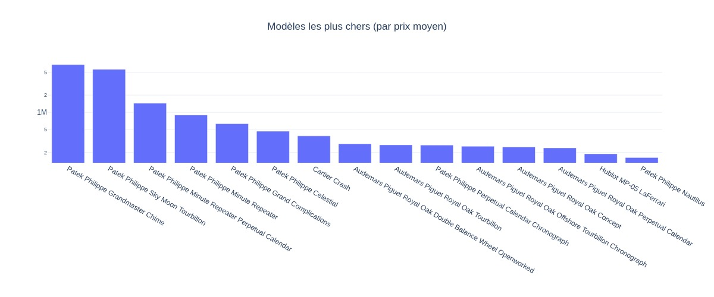

## Données

## Analyse des dernières données
Nom du dernier fichier: out_2024_09_02.csv

## Détails des marques
|Marque|Nombre d'annonces|Prix moyen|Prix max|Prix median|
|------|-----------------|----------|--------|-----------|
|audemarspiguet|13105|63227 €|1523912 €|40307 €| 
|breitling|21880|5465 €|147066 €|4438 €| 
|cartier|19768|8510 €|317967 €|5547 €| 
|hublot|12196|16032 €|543400 €|12750 €| 
|jaegerlecoultre|7039|11305 €|386605 €|7990 €| 
|omega|44284|5738 €|277352 €|4475 €| 
|panerai|8089|8368 €|237598 €|6425 €| 
|patekphilippe|13161|84717 €|6750000 €|50490 €| 
|rolex|86253|19191 €|1990000 €|13038 €| 
|seiko|21034|988 €|146892 €|510 €| 
|tagheuer|14193|2947 €|116738 €|2264 €| 
|tissot|6610|647 €|27214 €|495 €| 
|tudor|10700|3904 €|109092 €|3450 €| 

## Détails des modèles
Nom du modèle|Nombre d'annonces|Prix moyen|Prix median|
|-------------|-----------------|----------|-----------|
|               Rolex Datejust 36|11269|9663 €|8400 €| 
|               Rolex Daytona|9071|48632 €|36900 €| 
|               Rolex Datejust 41|7377|13398 €|13490 €| 
|               Rolex Submariner Date|6791|17724 €|14787 €| 
|               Rolex GMT-Master II|6336|21434 €|18072 €| 
|               Rolex Lady-Datejust|5232|8625 €|7098 €| 
|               Seiko|4748|664 €|361 €| 
|               Omega Seamaster Diver 300 M|4423|5912 €|4997 €| 
|               Omega Seamaster Aqua Terra|4363|6673 €|5316 €| 
|               Seiko Prospex|4192|1065 €|754 €| 
|               Rolex Datejust 31|3538|12098 €|11000 €| 
|               Omega Speedmaster Professional Moonwatch|3180|10140 €|6680 €| 
|               Omega Constellation|3158|5600 €|4473 €| 
|               Omega Seamaster|3065|2498 €|1490 €| 
|               Omega De Ville Prestige|2915|4913 €|3946 €| 
|               Patek Philippe Nautilus|2894|140125 €|108473 €| 
|               Rolex Sky-Dweller|2839|31317 €|24036 €| 
|               Rolex Day-Date 36|2837|31270 €|22988 €| 
|               Omega|2739|3554 €|1513 €| 
|               Breitling|2703|6068 €|4899 €| 
|               Patek Philippe Calatrava|2593|24927 €|22142 €| 
|               Audemars Piguet Royal Oak Offshore Chronograph|2590|39596 €|32905 €| 
|               Omega Speedmaster|2493|9407 €|7350 €| 
|               Seiko Presage|2342|798 €|600 €| 
|               Rolex Day-Date 40|2193|56268 €|49654 €| 
|               Rolex Explorer II|2143|11014 €|9846 €| 
|               Seiko 5 Sports|2132|371 €|309 €| 
|               Hublot Classic Fusion|2043|11964 €|9014 €| 
|               Cartier Santos|1993|10222 €|7250 €| 
|               Audemars Piguet Royal Oak Chronograph|1977|75909 €|60093 €| 

 Readme generated on 02/09/2024 18:47:05