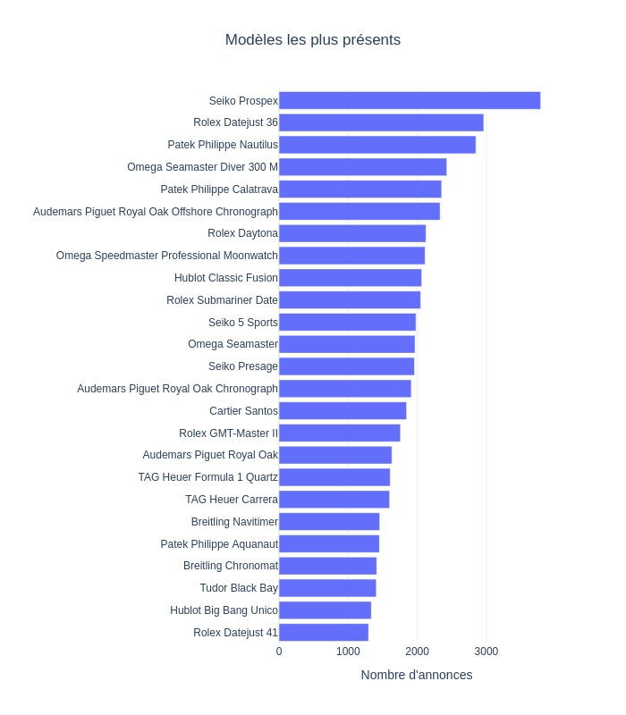

## Données

## Analyse des dernières données
Nom du dernier fichier: out_2024_09_02.csv

## Détails des marques
|Marque|Nombre d'annonces|Prix moyen|Prix max|Prix median|
|------|-----------------|----------|--------|-----------|
|audemarspiguet|12661|63404 €|1523912 €|40379 €| 
|breitling|20859|5456 €|147066 €|4433 €| 
|cartier|19061|8509 €|317967 €|5547 €| 
|hublot|11366|15925 €|543400 €|12573 €| 
|jaegerlecoultre|6809|11331 €|386605 €|7990 €| 
|omega|42198|5688 €|277352 €|4439 €| 
|panerai|7820|8376 €|237598 €|6423 €| 
|patekphilippe|12827|84846 €|6750000 €|50253 €| 
|rolex|83102|19180 €|1990000 €|13036 €| 
|seiko|20335|989 €|146892 €|510 €| 
|tagheuer|13048|3014 €|116738 €|2318 €| 
|tissot|6399|650 €|27214 €|499 €| 
|tudor|10358|3896 €|109092 €|3450 €| 

## Détails des modèles
Nom du modèle|Nombre d'annonces|Prix moyen|Prix median|
|-------------|-----------------|----------|-----------|
|               Rolex Datejust 36|10877|9668 €|8408 €| 
|               Rolex Daytona|8726|48557 €|36894 €| 
|               Rolex Datejust 41|7094|13391 €|13488 €| 
|               Rolex Submariner Date|6545|17736 €|14790 €| 
|               Rolex GMT-Master II|6078|21469 €|18072 €| 
|               Rolex Lady-Datejust|5043|8603 €|7094 €| 
|               Seiko|4592|666 €|361 €| 
|               Omega Seamaster Diver 300 M|4247|5890 €|4991 €| 
|               Omega Seamaster Aqua Terra|4149|6637 €|5300 €| 
|               Seiko Prospex|4046|1065 €|755 €| 
|               Rolex Datejust 31|3415|12063 €|10999 €| 
|               Omega Speedmaster Professional Moonwatch|3062|10097 €|6674 €| 
|               Omega Seamaster|2945|2478 €|1478 €| 
|               Omega Constellation|2899|5458 €|4300 €| 
|               Patek Philippe Nautilus|2807|140097 €|108313 €| 
|               Rolex Sky-Dweller|2738|31358 €|24036 €| 
|               Rolex Day-Date 36|2728|31294 €|22976 €| 
|               Omega De Ville Prestige|2716|4814 €|3857 €| 
|               Omega|2640|3519 €|1500 €| 
|               Breitling|2589|6066 €|4880 €| 
|               Patek Philippe Calatrava|2535|24912 €|22142 €| 
|               Audemars Piguet Royal Oak Offshore Chronograph|2499|39604 €|32900 €| 
|               Omega Speedmaster|2379|9351 €|7341 €| 
|               Seiko Presage|2265|802 €|603 €| 
|               Rolex Day-Date 40|2112|56301 €|49560 €| 
|               Rolex Explorer II|2075|11033 €|9850 €| 
|               Seiko 5 Sports|2070|369 €|308 €| 
|               Audemars Piguet Royal Oak Chronograph|1904|75647 €|60092 €| 
|               Cartier Santos|1902|10270 €|7250 €| 
|               Hublot Classic Fusion|1860|11768 €|8842 €| 

 Readme generated on 02/09/2024 12:57:07