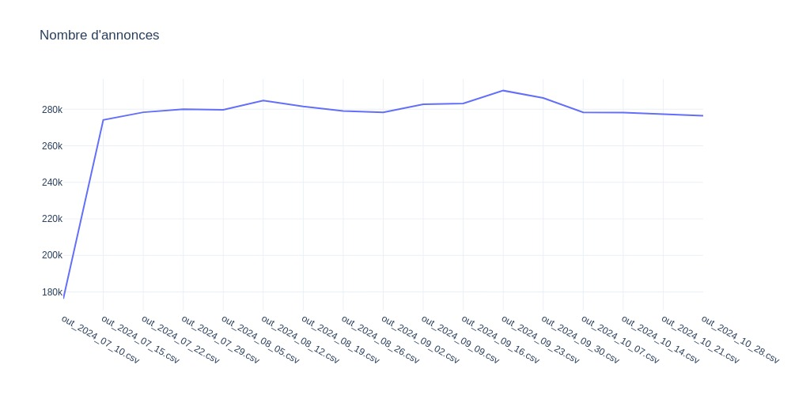

## Données

## Analyse des dernières données
Nom du dernier fichier: out_2024_10_21.csv

## Détails des marques
|Marque|Nombre d'annonces|Prix moyen|Prix max|Prix median|
|------|-----------------|----------|--------|-----------|
|audemarspiguet|11825|64271 €|1502489 €|41041 €| 
|breitling|21216|5185 €|91586 €|4323 €| 
|cartier|18290|8670 €|314919 €|5737 €| 
|hublot|11293|16365 €|543400 €|12941 €| 
|jaegerlecoultre|6643|11646 €|405443 €|8177 €| 
|omega|40109|5707 €|283489 €|4499 €| 
|panerai|7621|8475 €|250000 €|6492 €| 
|patekphilippe|12189|85550 €|6750000 €|50933 €| 
|rolex|78208|19739 €|1200000 €|13427 €| 
|seiko|17781|1006 €|145484 €|520 €| 
|tagheuer|12864|2917 €|116738 €|2274 €| 
|tissot|5537|638 €|27258 €|490 €| 
|tudor|9967|3849 €|111505 €|3440 €| 

## Détails des modèles
Nom du modèle|Nombre d'annonces|Prix moyen|Prix median|
|-------------|-----------------|----------|-----------|
|               Rolex Datejust 36|9954|9987 €|8711 €| 
|               Rolex Daytona|8182|49640 €|37750 €| 
|               Rolex Datejust 41|6701|13563 €|13693 €| 
|               Rolex Submariner Date|6010|17795 €|14750 €| 
|               Rolex GMT-Master II|5618|22082 €|18220 €| 
|               Rolex Lady-Datejust|5132|9068 €|7512 €| 
|               Omega Seamaster Diver 300 M|4129|5832 €|4990 €| 
|               Omega Seamaster Aqua Terra|4089|6660 €|5305 €| 
|               Seiko|3922|668 €|369 €| 
|               Rolex Datejust 31|3613|13111 €|11900 €| 
|               Seiko Prospex|3580|1063 €|742 €| 
|               Breitling|3136|4606 €|3927 €| 
|               Omega Speedmaster Professional Moonwatch|2873|10059 €|6669 €| 
|               Omega Seamaster|2842|2487 €|1500 €| 
|               Omega Constellation|2739|5403 €|4300 €| 
|               Rolex Sky-Dweller|2713|31310 €|24286 €| 
|               Rolex Day-Date 36|2668|33360 €|24250 €| 
|               Omega|2591|3153 €|1391 €| 
|               Patek Philippe Nautilus|2563|143440 €|108888 €| 
|               Omega De Ville Prestige|2541|4987 €|4074 €| 
|               Omega Speedmaster|2364|9357 €|7337 €| 
|               Audemars Piguet Royal Oak Offshore Chronograph|2349|40341 €|34019 €| 
|               Patek Philippe Calatrava|2308|25556 €|22907 €| 
|               Seiko Presage|2131|772 €|575 €| 
|               Rolex Day-Date 40|2048|57778 €|50900 €| 
|               Hublot Classic Fusion|1992|12914 €|9120 €| 
|               Cartier Santos|1892|10401 €|7350 €| 
|               Rolex Explorer II|1829|11088 €|9912 €| 
|               Audemars Piguet Royal Oak Chronograph|1770|75806 €|60470 €| 
|               Seiko 5 Sports|1710|380 €|320 €| 

 Readme generated on 21/10/2024 06:52:29